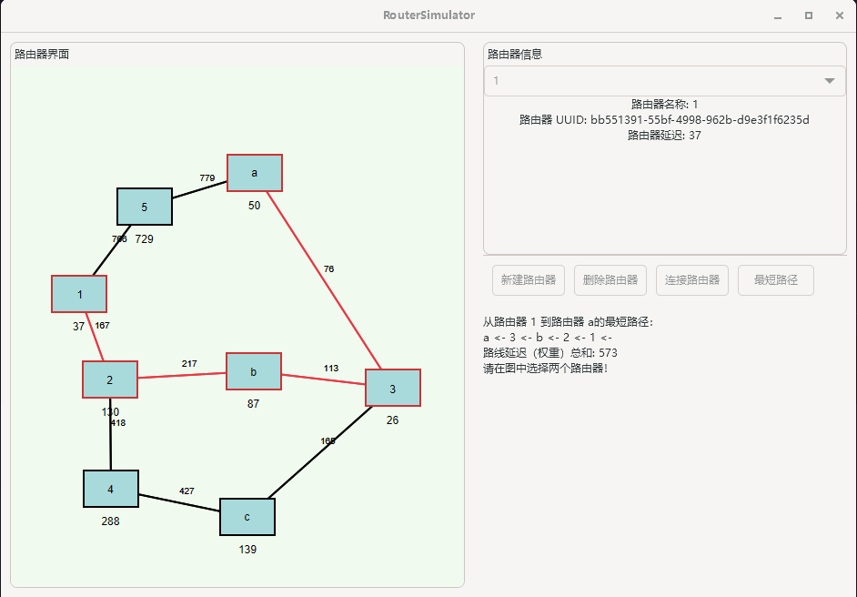

## 运行截图



## 从源代码编译

- Linux
    1. 安装gcc、CMake、Ninja或Make
    2. 安装gtkmm-4.0相关库
    3. 使用CMake构建源文件

- Windows
    1. 安装MSYS2、CMake、Ninja或Make
    2. 在MSYS2
       Shell使用pacman安装[mingw-w64-x86_64-toolchain](https://packages.msys2.org/groups/mingw-w64-x86_64-toolchain)
       和[mingw-w64-x86_64-gtkmm-4.0](https://packages.msys2.org/packages/mingw-w64-x86_64-gtkmm-4.0)
    3. 配置CMake使用MSYS2的MinGW64编译器
    4. 使用CMake构建源文件

```shell
cmake -B build -G Ninja -DCMAKE_BUILD_TYPE=Release
cd build
ninja
```

## 待完善

- [ ] Cairo绘制中文字体
- [ ] PanedWidget高度
- [ ] 动态宽高

## Credit

- [gtkmm](https://gtkmm.gnome.org/zh_CN/index.html)
    - [libsigc++](https://libsigcplusplus.github.io/libsigcplusplus/)
    - [glibmm](https://gnome.pages.gitlab.gnome.org/glibmm/)
    - [pangomm](https://gnome.pages.gitlab.gnome.org/pangomm/)
- 另见librouter下的[Credit](librouter/README.md)